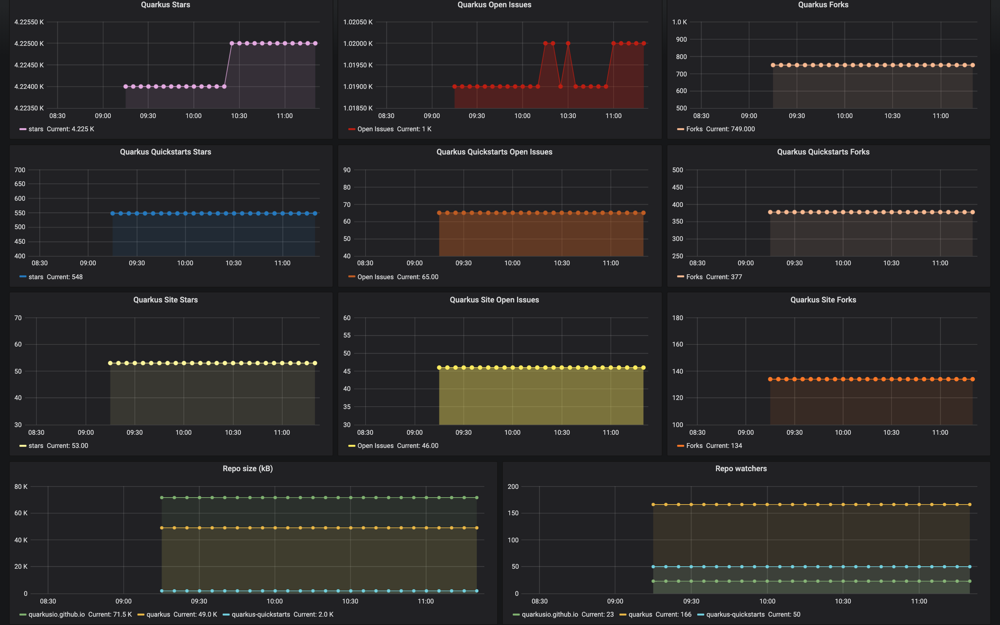

# Monitoring of GitHub projects using Prometheus and Grafana



Based on https://github.com/vegasbrianc/github-monitoring with following changes:
```diff
$ git diff
diff --git a/docker-compose.yml b/docker-compose.yml
index d1084d7..80bb8c3 100644
--- a/docker-compose.yml
+++ b/docker-compose.yml
@@ -50,7 +50,7 @@ services:
       - 9171:9171
     image: infinityworks/github-exporter:latest
     environment:
-      - REPOS=freeCodeCamp/freeCodeCamp, docker/docker
-      - GITHUB_TOKEN=<GitHub API Token see README>
+      - REPOS=quarkusio/quarkus, quarkusio/quarkus-quickstarts, quarkusio/quarkusio.github.io
+      - GITHUB_TOKEN=aaaaaaaaaaaaaaaaaaaaaaaaaa
     networks:
       - back-tier
diff --git a/prometheus/prometheus.yml b/prometheus/prometheus.yml
index ae6ffd7..0d5c635 100644
--- a/prometheus/prometheus.yml
+++ b/prometheus/prometheus.yml
@@ -22,7 +22,7 @@ scrape_configs:
   - job_name: 'prometheus'

     # Override the global default and scrape targets from this job every 5 seconds.
-    scrape_interval: 5s
+    scrape_interval: 30s

     static_configs:
          - targets: ['localhost:9090']
@@ -31,7 +31,7 @@ scrape_configs:
   - job_name: 'metrics'

     # Override the global default and scrape targets from this job every 5 seconds.
-    scrape_interval: 5s
+    scrape_interval: 30s

     static_configs:
          - targets: ['metrics:9171']
```

Grafana dashboard definition: [GitHubStats-Quarkus-3x3-plus-1x2.json](GitHubStats-Quarkus-3x3-plus-1x2.json)
Dashboard installation steps: https://github.com/vegasbrianc/github-monitoring#manual-install-dashboard