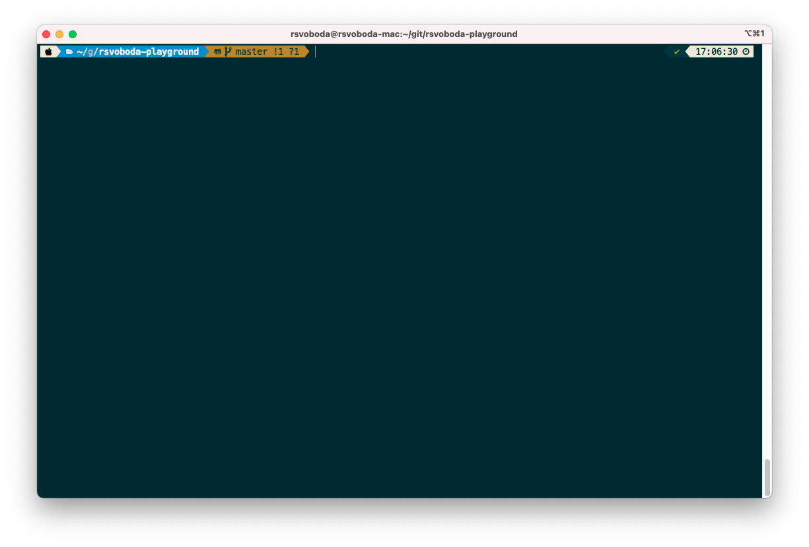

# macOS - terminal setup

## iTerm2
 - https://iterm2.com/
 - https://formulae.brew.sh/cask/iterm2

## Powerline
- https://github.com/b-ryan/powerline-shell 
- https://github.com/powerline/fonts

## zsh + iTerm2 + Powerline fonts + VS Code
 - https://gist.github.com/kevin-smets/8568070
 - https://github.com/romkatv/powerlevel10k
 - https://gist.github.com/DukeNgn/9312a65e1535b3b1bffd9fed2c892079
 - used font `MesloLGS NF`

## Screenshot
