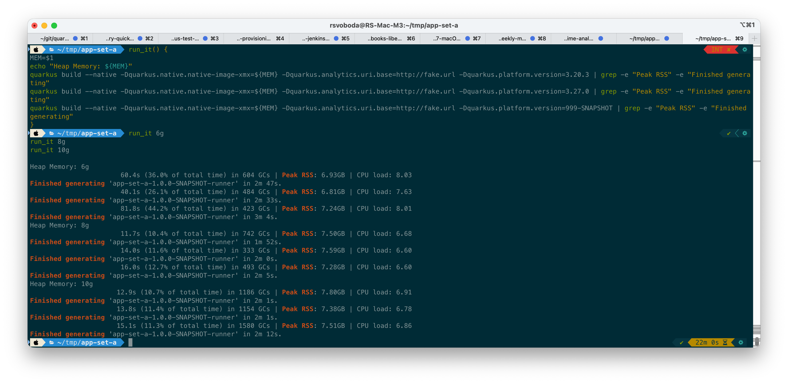
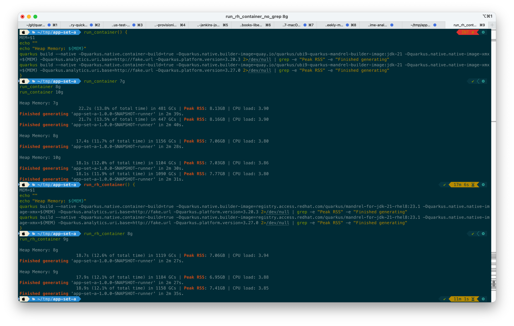
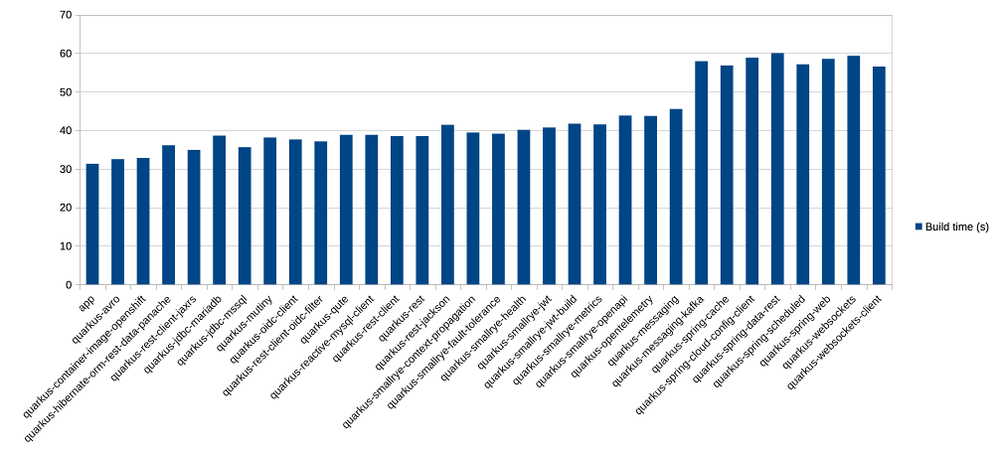
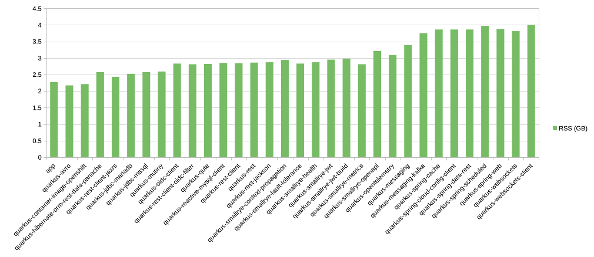

# Quarkus native image build investigation

## Problem statement
CliProdModeNativeIT.extensionSetA (https://github.com/quarkus-qe/quarkus-test-suite/blob/main/build-time-analytics/src/test/java/io/quarkus/ts/buildtimeanalytics/CliProdModeNativeIT.java#L34) test sometimes OOMs, and even when it doesn't, native compile recommends to increase max heap size:

```
18:43:31 16:43:31,291 INFO  GC warning: 120.2s spent in 63 GCs during the last stage, taking up 89.07% of the time.
18:43:31 16:43:31,291 INFO              Please ensure more than 5.95GB of memory is available for Native Image
18:43:31 16:43:31,291 INFO              to reduce GC overhead and improve image build time.
```


## Investigation with the defined set
System and application used for experiments:
 * MBP M3 Pro, macOS 26
 * vanilla application (no code samples) with extensions: https://github.com/quarkus-qe/quarkus-test-suite/blob/main/build-time-analytics/src/test/java/io/quarkus/ts/buildtimeanalytics/AnalyticsUtils.java#L31

Command to generate the application:
```
quarkus create app rh.quarkus.qe:app-set-a --platform-bom=io.quarkus:quarkus-bom:999-SNAPSHOT -x=quarkus-agroal,quarkus-arc,quarkus-cache,quarkus-config-yaml,quarkus-core,quarkus-grpc,quarkus-hibernate-orm,quarkus-hibernate-orm-panache,quarkus-hibernate-validator,quarkus-infinispan-client,quarkus-jackson,quarkus-jaxb,quarkus-jdbc-mysql,quarkus-jdbc-postgresql,quarkus-jsonb,quarkus-jsonp,quarkus-kafka-client,quarkus-micrometer,quarkus-micrometer-registry-prometheus,quarkus-narayana-jta,quarkus-oidc,quarkus-openshift-client,quarkus-quartz,quarkus-reactive-pg-client,quarkus-reactive-routes,quarkus-resteasy-client,quarkus-resteasy-client-jaxb,quarkus-resteasy,quarkus-resteasy-jackson,quarkus-resteasy-jaxb,quarkus-resteasy-jsonb,quarkus-scheduler,quarkus-smallrye-graphql-client,quarkus-smallrye-reactive-streams-operators,quarkus-spring-boot-properties,quarkus-spring-data-jpa,quarkus-spring-di,quarkus-spring-security,quarkus-undertow,quarkus-vertx --no-code --no-wrapper
```

Commands to build the native application:
```
quarkus build --native -Dquarkus.native.native-image-xmx=${MEM} -Dquarkus.analytics.uri.base=http://fake.url -Dquarkus.platform.version=3.27.0 | grep -e "Peak RSS" -e "Finished generating"

quarkus build --native -Dquarkus.native.container-build=true -Dquarkus.native.builder-image=quay.io/quarkus/ubi9-quarkus-mandrel-builder-image:jdk-21 -Dquarkus.native.native-image-xmx=${MEM} -Dquarkus.analytics.uri.base=http://fake.url -Dquarkus.platform.version=3.27.0 2>/dev/null | grep -e "Peak RSS" -e "Finished generating"

quarkus build --native -Dquarkus.native.container-build=true -Dquarkus.native.builder-image=registry.access.redhat.com/quarkus/mandrel-for-jdk-21-rhel8:23.1 -Dquarkus.native.native-image-xmx=${MEM} -Dquarkus.analytics.uri.base=http://fake.url -Dquarkus.platform.version=3.27.0 2>/dev/null | grep -e "Peak RSS" -e "Finished generating"
```

### Mandrel 23.1 from the system


 * 8 GB xmx looks like a sweet spot
 * There is no major difference between Quarkus 3.20 and 3.27 in build time and peak RSS usage

### Mandrel 23.1 from container


 * Container build is more resource-demanding
 * 8 GB xmx looks like a reasonable baseline
 * 6 GB xmx runs either failed or spent 2 minutes in GC activities

### Current conclusions:
 * https://github.com/quarkus-qe/quarkus-test-suite/blob/main/build-time-analytics/pom.xml#L14 should be bumped to 8g
 * All "quarkus.native.native-image-xmx" settings in QE TS should be revised
 * Jenkins jobs adjustments regarding native-image-xmx should be reviewed


## Investigate extensions from the set one by one

Investigate extensions from the set one by one to see their contribution to Peak RSS and build time.

### Testing flow
Iterate through the set of extensions, add each extension, build it, report the peak RSS, and record the build time.
Use "Mandrel 23.1 from the system" approach as it's the fastest and least resource-hungry one.

```
SET=quarkus-avro,quarkus-container-image-openshift,quarkus-hibernate-orm-rest-data-panache,quarkus-rest-client-jaxrs,quarkus-jdbc-mariadb,quarkus-jdbc-mssql,quarkus-mutiny,quarkus-oidc-client,quarkus-rest-client-oidc-filter,quarkus-qute,quarkus-reactive-mysql-client,quarkus-rest-client,quarkus-rest,quarkus-rest-jackson,quarkus-smallrye-context-propagation,quarkus-smallrye-fault-tolerance,quarkus-smallrye-health,quarkus-smallrye-jwt,quarkus-smallrye-jwt-build,quarkus-smallrye-metrics,quarkus-smallrye-openapi,quarkus-opentelemetry,quarkus-messaging,quarkus-messaging-kafka,quarkus-spring-cache,quarkus-spring-cloud-config-client,quarkus-spring-data-rest,quarkus-spring-scheduled,quarkus-spring-web,quarkus-websockets,quarkus-websockets-client

build_native() {
MEM=6g
quarkus build --native -Dquarkus.native.native-image-xmx=${MEM} -Dquarkus.analytics.uri.base=http://fake.url | grep -e "Peak RSS" -e "Finished generating"
}

rm -rf app
sdk use java 23.1.8.r21-mandrel
quarkus create app rh.quarkus.qe:app -x=quarkus-rest --platform-bom=io.quarkus:quarkus-bom:999-SNAPSHOT --no-code --no-wrapper 

cd app
echo " ... base app"
build_native

for i in $(echo $SET | sed "s/,/ /g")
do
    echo ""
    echo " ... adding $i"
    quarkus extension add $i
    build_native
done
```

### Report
```
cat native-builds-log.txt| grep '\.\.\.' | cut -d" " -f 4 > 001-modules.txt
cat native-builds-log.txt| grep 'RSS' | sed "s/.*RSS: //g" | sed "s/GB.*//g" > 002-rss.txt
cat native-builds-log.txt| grep 'Finished' | sed "s/.*in //g" | sed "s/s.//g" | sed "s/1m 0/60.0/" > 003-time.txt
paste -d"," 001-modules.txt 002-rss.txt 003-time.txt
```

Generated CSV
```
app,2.27,31.3
quarkus-avro,2.17,32.5
quarkus-container-image-openshift,2.21,32.8
quarkus-hibernate-orm-rest-data-panache,2.57,36.1
quarkus-rest-client-jaxrs,2.43,34.9
quarkus-jdbc-mariadb,2.52,38.6
quarkus-jdbc-mssql,2.57,35.6
quarkus-mutiny,2.59,38.1
quarkus-oidc-client,2.83,37.6
quarkus-rest-client-oidc-filter,2.81,37.1
quarkus-qute,2.82,38.8
quarkus-reactive-mysql-client,2.85,38.8
quarkus-rest-client,2.84,38.5
quarkus-rest,2.86,38.5
quarkus-rest-jackson,2.87,41.4
quarkus-smallrye-context-propagation,2.94,39.4
quarkus-smallrye-fault-tolerance,2.83,39.1
quarkus-smallrye-health,2.87,40.1
quarkus-smallrye-jwt,2.95,40.7
quarkus-smallrye-jwt-build,2.98,41.7
quarkus-smallrye-metrics,2.81,41.5
quarkus-smallrye-openapi,3.21,43.8
quarkus-opentelemetry,3.09,43.7
quarkus-messaging,3.39,45.5
quarkus-messaging-kafka,3.75,57.9
quarkus-spring-cache,3.86,56.8
quarkus-spring-cloud-config-client,3.86,58.8
quarkus-spring-data-rest,3.86,60.0
quarkus-spring-scheduled,3.97,57.1
quarkus-spring-web,3.88,58.5
quarkus-websockets,3.81,59.3
quarkus-websockets-client,4.00,56.5
```

Visualized Build time (s)


Visualized RSS (GB)


### Conclusions
 * Nothing unexpected was detected
 * quarkus-messaging and quarkus-messaging-kafka increase build time a lot
 * Addition of quarkus-rest-jackson is noticeable